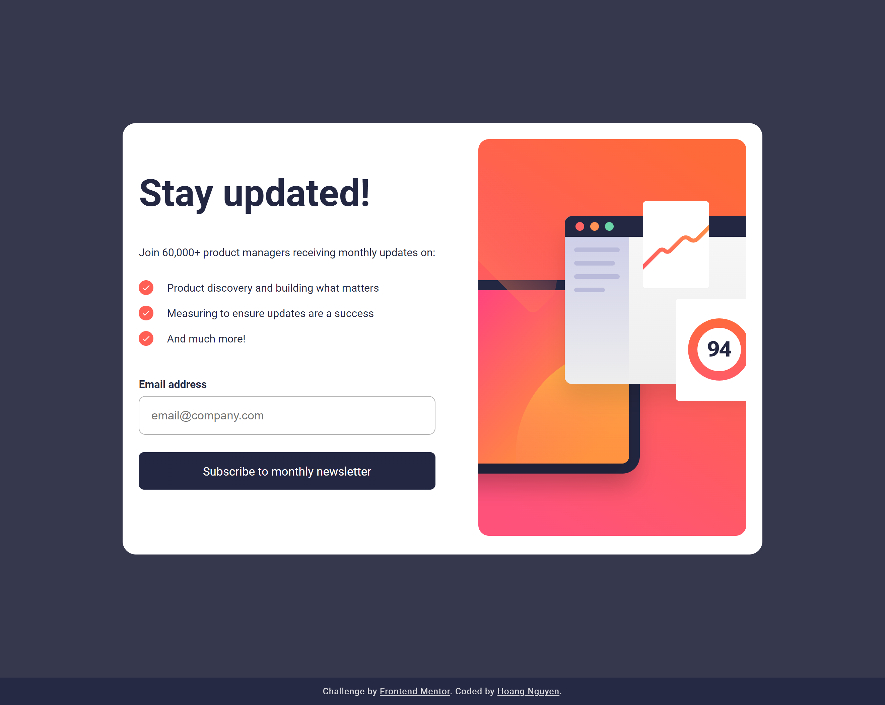

# Frontend Mentor - Newsletter sign-up form with success message solution

This is a solution to the [Newsletter sign-up form with success message challenge on Frontend Mentor](https://www.frontendmentor.io/challenges/newsletter-signup-form-with-success-message-3FC1AZbNrv). Frontend Mentor challenges help you improve your coding skills by building realistic projects. 

## Table of contents

- [Overview](#overview)
  - [The challenge](#the-challenge)
  - [Screenshot](#screenshot)
  - [Links](#links)
- [My process](#my-process)
  - [Built with](#built-with)
  - [What I learned](#what-i-learned)
  - [Continued development](#continued-development)
- [Author](#author)

## Overview

### The challenge

Users should be able to:

- Add their email and submit the form
- See a success message with their email after successfully submitting the form
- See form validation messages if:
  - The field is left empty
  - The email address is not formatted correctly
- View the optimal layout for the interface depending on their device's screen size
- See hover and focus states for all interactive elements on the page

### Screenshot



### Links

- Solution URL: [Live Solution](https://mmxcrono.github.io/newsletter-sign-up-with-success-message/)

## My process

I created the structure around the text provided. I proceeded to work on the desktop version and then the mobile styles.
I wanted to use sass styles with BEM naming convention. Mixins would help with responsive styling.

### Built with

- Semantic HTML5 markup
- CSS custom properties
- Flexbox

### What I learned

Creating web content without a framework is a bit more tedious and requires more effort to organize styles.

To see how you can add code snippets, see below:

```html
<h1>Some HTML code I'm proud of</h1>
```
```scss
  @include respond-to(medium) {
    flex-direction: column-reverse;
    padding: 0;
    max-width: 375px;
    border-radius: 0;
    gap: 1em;
  }
```

```js

const utils = {
  toggleClass: (targetClass, className, isAdd = false) => {
    for (const item of document.getElementsByClassName(targetClass)) {
      if (isAdd) {
        item.classList.add(className);
      }
      else {
        item.classList.remove(className);
      }
    }
  },
  setAttribute: (targetClass, attribute, value) => {
    for (const item of document.getElementsByClassName(targetClass)) {
      if (value === false) {
        item.removeAttribute(attribute);
      }
      else {
        item.setAttribute(attribute, value);
      }
    }
  }
}
```
### Continued development

- Clean up styles
- Solve using other frameworks such as React, Vue, or Angular

## Author

- Website - [Hoang Nguyen](https://mmxcrono.github.io)
- Frontend Mentor - [@mmxcrono](https://www.frontendmentor.io/profile/mmxcrono)
